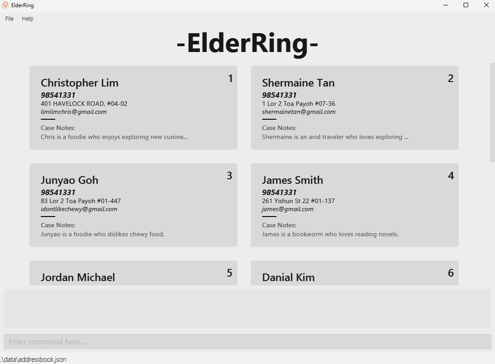

* ElderRing is an elderly care management address book for silver generation ambassadors and volunteers to easily facilitate and manage elderly clients by consolidating all their information in one place. 
* ElderRing maintains elderly records such as contact information, family details, medical notes, and schedules/
* The project simulates an ongoing software project for a desktop application (called ElderRing) used for managing elderly client information.
    * It is **written in OOP fashion**. It provides a **reasonably well-written** code base **bigger** (around 6 KLoC) than what students usually write in beginner-level SE modules, without being overwhelmingly big.
    * It comes with a **reasonable level of user and developer documentation**.
* It is named ElderRing because it aims to help Silver Generation Ambassadors form a “ring of care” around elderly clients by consolidating important details such as contact information, family details, medical notes, and schedules.
* For the detailed documentation of this project, see the **[ElderRing Product Website](https://ay2526s1-cs2103t-t14-4.github.io/tp/)**.
