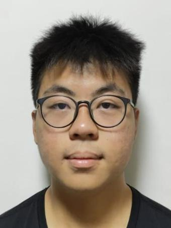
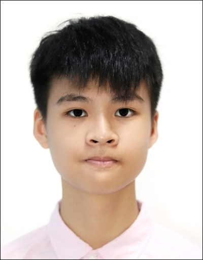
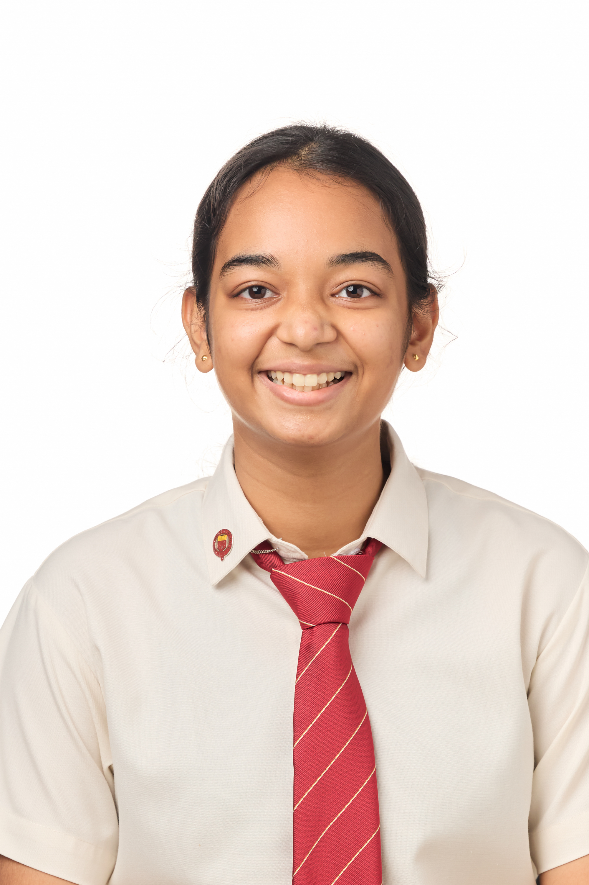
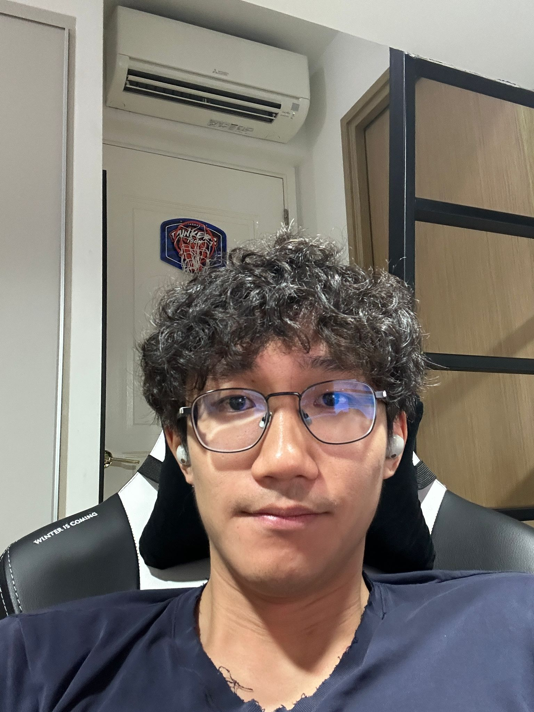

# About Us

We are a team based in the [School of Computing, National University of Singapore](http://www.comp.nus.edu.sg).

You can reach us at the email `seer[at]comp.nus.edu.sg`

## Project team

### Wei Lun

[[github](https://github.com/swei99)]

* Role: Project Supervisor

### Lim Jun Sheng, Wallace

[[github](https://github.com/codewallie)]

* Role: Developer
* Responsibilities: UI

### Jhanvi Sahu

[[github](https://github.com/jj55j7)]

* Role: Project Advisor
* Responsibilities: Data

### Kai Xiang

[[github](https://github.com/OKaiXiang)]

* Role: Developer
* Responsibilities: Dev Ops + Threading

### James Doe

[[github](http://github.com/johndoe)]
[[portfolio](team/johndoe.md)]

* Role: Developer
* Responsibilities: UI
