# ElderRing User Guide

## Introduction
Welcome to **ElderRing**, a **Command Line Interface (CLI)** desktop application specially made for **Silver Generation Ambassadors (SGAs)** to better **manage and organise senior clients' information** more efficiently. With simple-to-type commands, seniors' contacts can be managed faster than traditional Graphical User Interface (GUI) applications.

 

<!-- * Table of Contents -->
<page-nav-print />

## Table of Contents
* [How to Read This Guide](#how-to-read-this-guide)
* [Understanding the User Guide](#understanding-the-user-guide)
* [Quick Start](#quick-start)
* [Parameters](#parameters)
* [Features](#features)
    * [Viewing help: `help`](#viewing-help-help)
    * [Adding a senior: `add`](#adding-a-senior-add)
    * [Editing a senior: `edit`](#editing-a-senior-edit)
    * [Deleting a senior: `delete`](#deleting-a-senior-delete)
    * [Listing all seniors: `list`](#listing-all-seniors-list)
    * [Sorting entries: `sort`](#sorting-entries-sort)
    * [Locating seniors by name: `find`](#locating-seniors-by-name-find)
    * [Adding notes to a senior: `remark`](#adding-notes-to-a-senior-remark)
    * [Tagging a senior: `tag`](#tagging-a-senior-tag)
    * [Filtering entries: `filter`](#filtering-entries-filter)
    * [Clearing all entries: `clear`](#clearing-all-entries-clear)
    * [Exiting the program: `exit`](#exiting-the-program-exit)
    * [Saving the data](#saving-the-data)
    * [Editing the data file](#editing-the-data-file)
* [FAQ](#faq)
* [Known Issues](#known-issues)
* [Command Summary](#command-summary)

 

--------------------------------------------------------------------------------------------------------------------

 

## How to Read This Guide

This guide is designed for all SGAs, whether you're just starting out or are already familiar with ElderRing.

If you are **new to ElderRing**:
- Head to [Quick Start](#quick-start) to learn how to get started.

If you have **experience with ElderRing**:
- Check out the [Command Summary](#command-summary) for a quick overview of the various commands and their usage.
- Check out the [Features](#features) section for a more in-depth breakdown of each feature.

 

<a href="#introduction">Back to top</a>

 

--------------------------------------------------------------------------------------------------------------------

 

### Understanding the User Guide

This section outlines the different kind of elements found in this guide and what they represent.

  #### Additional Information

  Additional information is indicated as a box with an "**i**" symbol.

  <box type="info" seamless>

  This is an example of additional information.

  </box>

  #### Tips

  Tips are displayed as a box with a "**💡**" symbol.

  <box type="tip" seamless>

  This is an example of a tip.

  </box>

  #### Warnings

  Warnings are displayed as a box with a "**!**" symbol.

  <box type="warning">

  This is an example of a warning.

  </box>

 

<a href="#introduction">Back to top</a>

 

--------------------------------------------------------------------------------------------------------------------

 

## Quick Start

This guide serves as a walkthrough on **how to install ElderRing** and **how to use it**.

<box header=" **By the end of this section, you will:**">

- have installed **ElderRing** on your computer.
- know how to run **ElderRing**.

</box>

### Installation
1. Ensure you have Java `17` or above installed on your computer. 

<box type="info" seamless>

If you are unsure of how to install Java, follow this [guide](https://www.java.com/en/download/help/download_options.html).

Ensure you have the precise JDK version prescribed based on your following OS:
- **Mac users:**  [Click here](https://se-education.org/guides/tutorials/javaInstallationMac.html).
- **Windows users:**  [Click here](https://se-education.org/guides/tutorials/javaInstallationWindows.html).
- **Linux users:**  [Click here](https://se-education.org/guides/tutorials/javaInstallationLinux.html).

</box>

2. Download the latest [`ElderRing.jar`](https://github.com/AY2526S1-CS2103T-T14-4/tp/releases).

3. Copy the file to the folder you want to use as the _home folder_ for ElderRing.

4. Open a command terminal.

5. Change your directory to the folder containing `ElderRing.jar` using 
   `cd [path from current position to the folder containing ElderRing.jar]`.

6. Run the following command in the terminal to launch the application
   `java -jar ElderRing.jar`.

7. A GUI similar to the one below should appear in a few seconds. Note how the app contains some sample data.  
   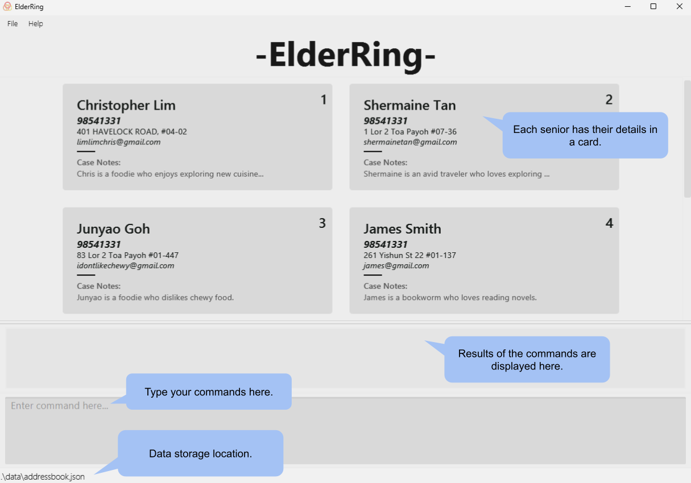{width=800px}

8. Type a command in the command box (located at the bottom of the window) and press Enter to execute it.

<box type="tip" seamless>

**Tip:** Typing **`help`** and pressing Enter opens the help window.

</box>

   Some example commands you can try:
   * `list` : Lists all seniors.
   * `add n/John Doe p/98765432 e/doe@sg.com a/St 9, blk 7, #01-01` : Adds a senior named `John Doe` to ElderRing.
   * `delete i/3` : Deletes the 3rd senior shown in the current list.
   * `clear --removeall` : Deletes all seniors.
   * `exit` : Exits the app.

9. Refer to the [Features](#features) section below for details of each command.

 

<a href="#introduction">Back to top</a>

 

--------------------------------------------------------------------------------------------------------------------

 

## Parameters

This section covers the different parameters in ElderRing and their respective constraints.

<box type="warning">

To make sure commands to work successfully, ensure that all parameters follow the constraints mentioned below.

Characters with accents or diacritics (e.g., à, é, ô, ÿ) as well as those from non-Latin alphabets (e.g., Я (Cyrillic – Russian), あ (Japanese – Hiragana), ض (Arabic)), are currently **not supported**.

</box>

| Parameter      | Description                                   | Constraints                                                                                                                                                                                                                                                                                                                                              | Example                                                                                                                                                                                                                                                          |
|----------------|-----------------------------------------------|----------------------------------------------------------------------------------------------------------------------------------------------------------------------------------------------------------------------------------------------------------------------------------------------------------------------------------------------------------|------------------------------------------------------------------------------------------------------------------------------------------------------------------------------------------------------------------------------------------------------------------|
| `NAME`         | Senior’s name                                 | <ul><li>Only letters and spaces are permitted.</li><li>This parameter cannot be left blank.</li><li>If you need to include terms like "s/o" or "d/o" in a name, please use alternatives such as "son of" or "s o" instead.</li><li>Only English letters with single spaces between words are allowed.</li><li>Maximum length of 66 characters.</li></ul> | :fa-solid-check:  `John Doe`   :fa-solid-xmark:  `J@mes` `ジョン ドー` `俊涵`                                                                                                                                                                         |
| `PHONE_NUMBER` | Senior’s phone number                         | <ul><li>Only numbers are allowed.</li><li>This parameter cannot be left blank.</li><li>Only accepts numbers that start with 6, 8, 9.</li><li>Only 8-digit numbers are accepted.</li></ul>                                                                                                                                                                | :fa-solid-check:  `91234567`   :fa-solid-xmark: `+65 1234 5678` `12345678`                                                                                                                                                                        |
| `ADDRESS`      | Senior’s residential address                  | <ul><li>Maximum length of 100 characters.</li> </ul>                                                                                                                                                                                                                                                                                                     | :fa-solid-check:  `Blk 41 Telok Blangah Way #07-436`   :fa-solid-xmark: `College Avenue East 36/38, Ngee Ann Kongsi Auditorium, Singapore 138677, East North Tower #02-211/212`                                                                      |
| `EMAIL`        | Senior’s email address                        | <ul><li>Emails should be in the format `local-part@domain`.</li><li>`local-part` must at least contain one letter or digit.</li><li>`domain` must at least contain one letter.</li><li>Emails will be stored in all lowercase regardless of input.</li><li>Maximum length of 50 characters.</li></ul>                                                    | :fa-solid-check:  `johndoe123@gmail.com` `john@example` `nigel@example.c`   :fa-solid-xmark: `luk` `lu_+ke@gmail.com` `alex.ye_o+h@ex.amp-le.com``-luke@gmail.com` `mihir@example-.com` `lucas@ex/ample.com` `noel@example.c-m` |
| `TAG`          | Category/label applicable to seniors          | <ul><li>Maximum length of 30 characters for each tag.</li><li>Multiple tags allowed for each senior.</li></ul>                                                                                                                                                                                                                                           | :fa-solid-check:  `hard-of-hearing`    :fa-solid-xmark: `meredeka_generation_1950_to_1959`                                                                                                                                                           |
| `REMARK`       | Additional notes applicable to seniors        | <ul><li>Maximum length of 2500 characters.</li> </ul>                                                                                                                                                                                                                                                                                                    | :fa-solid-check:  `List of senior’s medications: Alprax (daily), Alprazolam (once every 3 days), ...`                                                                                                                                                      |
| `INDEX`        | The index shown in the displayed seniors list | <ul><li>Only whole numbers are allowed.</li><li>Number must be a positive number.</li><li>The index must refer to a valid entry in the current list.</li></ul>                                                                                                                                                                                           | :fa-solid-check:  `1`   :fa-solid-xmark: `0` `-1` `1 2`                                                                                                                                                                                        |

 

<box type="info" seamless>

**Duplicate Contact Criteria**

ElderRing considers contacts as duplicates based on the following criteria:

**For Adding New Contacts:**
* A contact is considered a duplicate if both its **name and phone number** match exactly with an existing contact
* Other fields (email, address, tags, remarks) can be the same and will not trigger duplicate detection
* Example: Adding "John Doe" with phone number "99998888" when another "John Doe" with phone number "99998888" already exists will fail

**For Editing Existing Contacts:**
* You can change a contact's name to match another contact **only if their phone numbers are different**
* You can change a contact's phone number to match another contact **only if their names are different**
* This prevents accidental creation of duplicates while allowing flexible updates

</box>

<box style="background: #fafafaff">

**Features at a glance:**
<a href="#viewing-help-help" class="badge bg-secondary">help</a> 
<a href="#adding-a-senior-add" class="badge bg-secondary">add</a> 
<a href="#editing-a-senior-edit" class="badge bg-secondary">edit</a> 
<a href="#deleting-a-senior-delete" class="badge bg-secondary">delete</a> 
<a href="#listing-all-seniors-list" class="badge bg-secondary">list</a> 
<a href="#sorting-entries-sort" class="badge bg-secondary">sort</a> 
<a href="#locating-seniors-by-name-find" class="badge bg-secondary">find</a> 
<a href="#adding-notes-to-a-senior-remark" class="badge bg-secondary">remark</a> 
<a href="#tagging-a-senior-tag" class="badge bg-secondary">tag</a> 
<a href="#filtering-entries-filter" class="badge bg-secondary">filter</a> 
<a href="#clearing-all-entries-clear" class="badge bg-secondary">clear</a> 
<a href="#exiting-the-program-exit" class="badge bg-secondary">exit</a> 

</box>

 

<a href="#introduction">Back to top</a>

 

--------------------------------------------------------------------------------------------------------------------

 

## Features

This section covers the list of commands and their usage. If you are experienced with the commands, you can refer to the [Command Summary](#command-summary) below for quicker reference.

<box type="info" seamless>

**Notes about the command format:** 

* Words in `UPPER_CASE` are the parameters to be supplied by the user. 

  <box>

  e.g., in `add n/NAME`, `NAME` is a parameter which can be used as `add n/John Doe`.

  </box>

* Parameters in `[ square brackets ]` are optional. 

  <box>

  e.g., `n/NAME [t/TAG]` can be used as `n/John Doe t/friend` or as `n/John Doe`.

  </box>

* Parameters split by the `|` symbol are alternatives.

  <box>

  e.g., `remark i/INDEX [r/REMARK | ap/APPEND_TEXT | --remove]` can be used as `remark i/1 r/Patient is diabetic.` or
  `remark i/1 ap/Prescribed diabetes medication.` or `remark i/1 --remove`.

  </box>

* Parameters with `…`​ after them can be used multiple times (including zero times). 

  <box>

  e.g., `[t/TAG]…​` can be used as ` ` (i.e. 0 times), `t/friend`, `t/friend t/family` etc.

  </box>

* Parameters can be in any order. 

  <box>

  e.g., if the command specifies `n/NAME p/PHONE_NUMBER`, `p/PHONE_NUMBER n/NAME` is also acceptable.

  </box>

* Extraneous parameters for commands that do not take in parameters (such as `help`, `list` and `exit`) are ignored. 

  <box>

  e.g., if the command specifies `help 123`, it is interpreted as `help`.

  </box>

* If you are using a PDF version of this document, be careful when copying and pasting commands that span multiple lines as space characters surrounding line-breaks may be omitted when copied over to the application.

</box>

### Viewing help : `help`

Shows a message explaining how to access the help page.

Format: `help`

<figure>

  
  <figcaption style="text-align: center; font-style: italic">
    <md>Results of the command: `help`</md>
  </figcaption>

</figure>

 

<box style="background: #fafafaff">

**Navigate to the subsections here:**
<a href="#parameters" class="badge bg-secondary">Parameters</a>
<a href="#command-summary" class="badge bg-secondary">Command Summary</a>
<a href="#introduction" class="badge bg-light text-dark">Back to top</a>

</box>

 

### Adding a senior : `add`

Adds a senior to ElderRing.

Format: `add n/NAME p/PHONE_NUMBER a/ADDRESS [e/EMAIL] [t/TAG]…​`

#### Parameters:

1. `NAME`: Mandatory.
2. `PHONE_NUMBER`: Mandatory.
3. `ADDRESS`: Mandatory.
4. `EMAIL`: Optional.
5. `TAG`: Optional.

Examples:
* `add n/Tan Ah Kow e/tak@gmail.com p/96521345 a/Blk 41 Telok Blangah Way #07-436 t/hard-of-hearing`
* `add n/Shermaine Tan p/98541331 a/1 Lor 2 Toa Payoh #07-36 e/shermainetan@gmail.com`

<figure>

  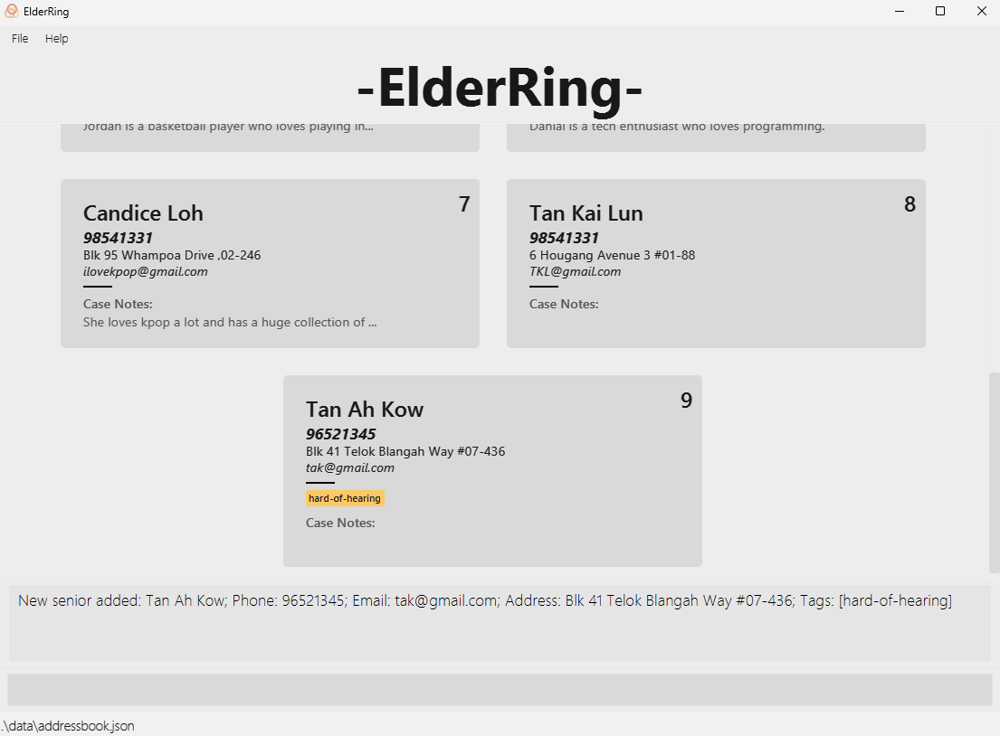
  <figcaption style="text-align: center; font-style: italic">
    <md>Results of the command: `add n/Tan Ah Kow e/tak@gmail.com p/96521345 a/Blk 41 Telok Blangah Way #07-436 t/hard-of-hearing`.</md>
  </figcaption>

</figure>

 

<box style="background: #fafafaff">

**Navigate to the subsections here:**
<a href="#parameters" class="badge bg-secondary">Parameters</a> 
<a href="#command-summary" class="badge bg-secondary">Command Summary</a>
<a href="#introduction" class="badge bg-light text-dark">Back to top</a>

</box>

 

### Editing a senior : `edit`

Edits an existing senior in ElderRing, only replacing the fields with new information specified in the user input.

<box type="info" seamless>

This feature cannot edit remarks.

</box>

Format: `edit i/INDEX [n/NAME] [p/PHONE_NUMBER] [e/EMAIL] [a/ADDRESS] [t/TAG]`

#### Parameters:

1. `INDEX`: Mandatory.
2. `NAME`: Optional.
3. `PHONE_NUMBER`: Optional.
4. `EMAIL`: Optional.
5. `ADDRESS`: Optional.
6. `TAG`: Optional.

<box type="info" seamless>

* Edits the senior at the specified `INDEX`. The index refers to the index number shown in the displayed senior list.
The index **must be a positive integer** 1, 2, 3, …​
* At least one of the optional fields must be provided.
* This feature replaces existing values with the new input values.
* Editing tags replaces existing tags (adding is not cumulative).
* Using `t/` with no value removes all of a senior’s tags.

</box>

Examples:
*  `edit i/10 t/Diabetic`
*  `edit i/1 n/Joseph p/92891234`

<figure>

  
  <figcaption style="text-align: center; font-style: italic">
    <md>Results of the command: `edit i/1 n/Joseph p/92891234`.</md>
  </figcaption>

</figure>

 

<box style="background: #fafafaff">

**Navigate to the subsections here:**
<a href="#parameters" class="badge bg-secondary">Parameters</a> 
<a href="#command-summary" class="badge bg-secondary">Command Summary</a>
<a href="#introduction" class="badge bg-light text-dark">Back to top</a>

</box>

 

### Deleting a senior : `delete`

Deletes the senior at the specified display `INDEX` or the senior with the matching `NAME` and `PHONE_NUMBER`.

Format: `delete i/INDEX` or `delete n/NAME p/PHONE_NUMBER`

#### Parameters:

Either:

1. `INDEX`: Mandatory.

Or:

2. `NAME`: Mandatory.
3. `PHONE_NUMBER`: Mandatory.

<box type="info" seamless>

* Deletes the senior at the specified `INDEX`.
* Deletes the senior matching the specified `NAME` and `PHONE_NUMBER`.

</box>

Examples:
* `list` followed by `delete i/2` deletes the second senior displayed in ElderRing.
* `delete n/Joseph p/92891234`

<figure>

  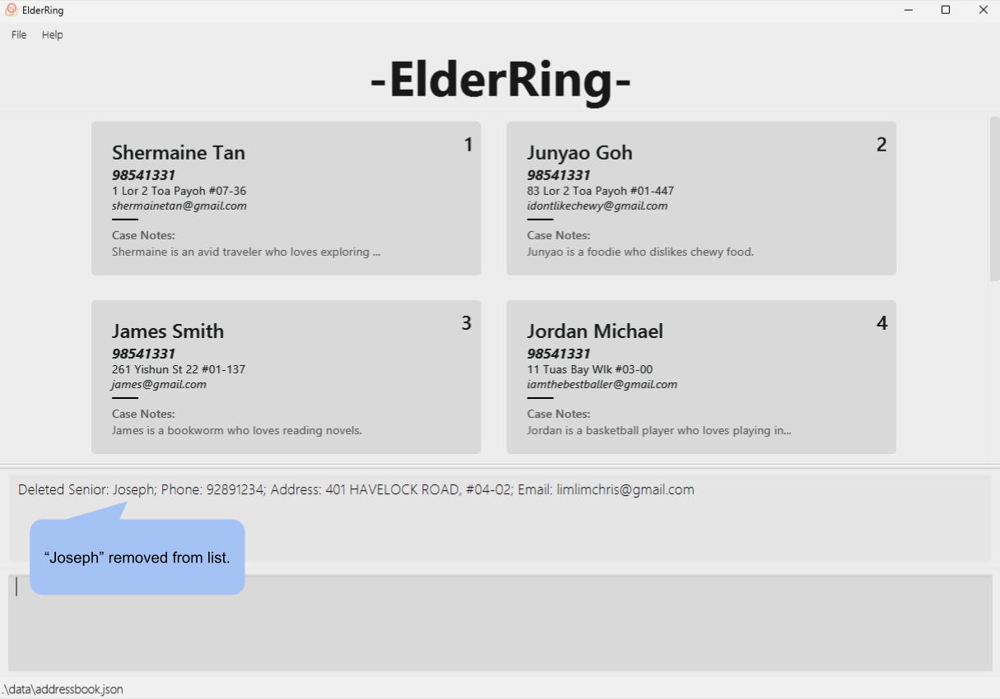
  <figcaption style="text-align: center; font-style: italic">
    <md>Results of the command: `delete n/Joseph p/92891234`.</md>
  </figcaption>

</figure>

 

<box style="background: #fafafaff">

**Navigate to the subsections here:**
<a href="#parameters" class="badge bg-secondary">Parameters</a> 
<a href="#command-summary" class="badge bg-secondary">Command Summary</a>
<a href="#introduction" class="badge bg-light text-dark">Back to top</a>

</box>

 

### Listing all seniors : `list`

Shows a list of all seniors in ElderRing.

Format: `list`

<figure>

  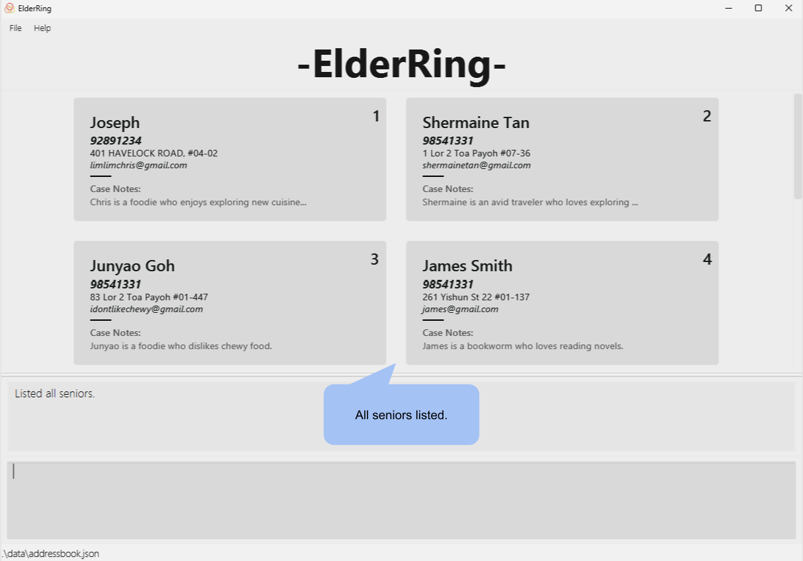
  <figcaption style="text-align: center; font-style: italic">
    <md>Results of the command: `list`.</md>
  </figcaption>

</figure>

<box type="tip" seamless>

**Tip:** Unhide long texts.

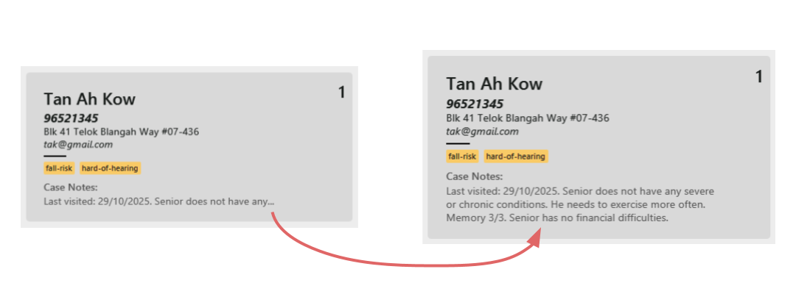
Clicking on the `...` expands the senior's full information. Clicking on the long text again hides it.

</box>

 

<box style="background: #fafafaff">

**Navigate to the subsections here:**
<a href="#parameters" class="badge bg-secondary">Parameters</a> 
<a href="#command-summary" class="badge bg-secondary">Command Summary</a>
<a href="#introduction" class="badge bg-light text-dark">Back to top</a>

</box>

 

### Sorting entries : `sort`

Sorts seniors by `NAME` or `ADDRESS` in ascending or descending order.

Format: `sort (ASC | DSC)/(NAME | ADDRESS)`

#### Parameters:

1. `ASC` or `DSC`: Mandatory.
2. `NAME` or `ADDRESS`: Mandatory.

<box type="info" seamless>

* `asc` sorts in ascending order.
* `dsc` sorts in descending order.
* `name` sorts by NAME.
* `address` sorts by ADDRESS.
* It is recommended to create address in the following order to maximize the sort by address functionality:
  * Estate → Street → Block → Unit Number → Postal Code.

</box>

Examples:
* `sort asc/name`
* `sort dsc/name`
* `sort asc/address`
* `sort dsc/address`

<figure>

  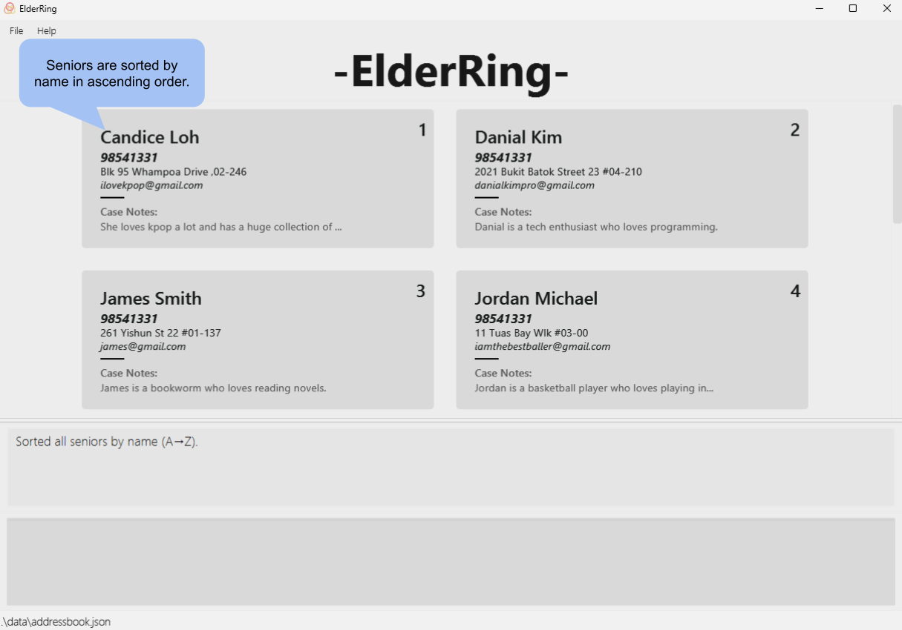
  <figcaption style="text-align: center; font-style: italic">
    <md>Results of the command: `sort asc/name`.</md>
  </figcaption>

</figure>

 

<box style="background: #fafafaff">

**Navigate to the subsections here:**
<a href="#parameters" class="badge bg-secondary">Parameters</a> 
<a href="#command-summary" class="badge bg-secondary">Command Summary</a>
<a href="#introduction" class="badge bg-light text-dark">Back to top</a>

</box>

 

### Locating seniors by name : `find`

Finds seniors whose names contain any of the input keywords.

Format: `find KEYWORD [MORE_KEYWORDS]`

* The search is case-insensitive (e.g., `hans` will match `Hans`).
* The order of the keywords does not matter (e.g., `Hans Bo` will match `Bo Hans`).
* This feature only searches names.
* This feature matches partial words within the name (e.g., `Han` will match `Hans`).
* This feature displays seniors matching at least one keyword
  (e.g., `Hans Bo` will match `Hans Gruber`, `Boyo Yang`).

Examples:
* `find tan` displays `Shermaine Tan`, `Tan Ah Kow` and `Tan Kai Lun`.
* `find can ran` displays `Candice Lim`, `Randy Tan`, `Ranger Lee`.
* `find charlotte bernice` displays `Bernice Yu`, `Charlotte Oliveiro`.

<figure>

  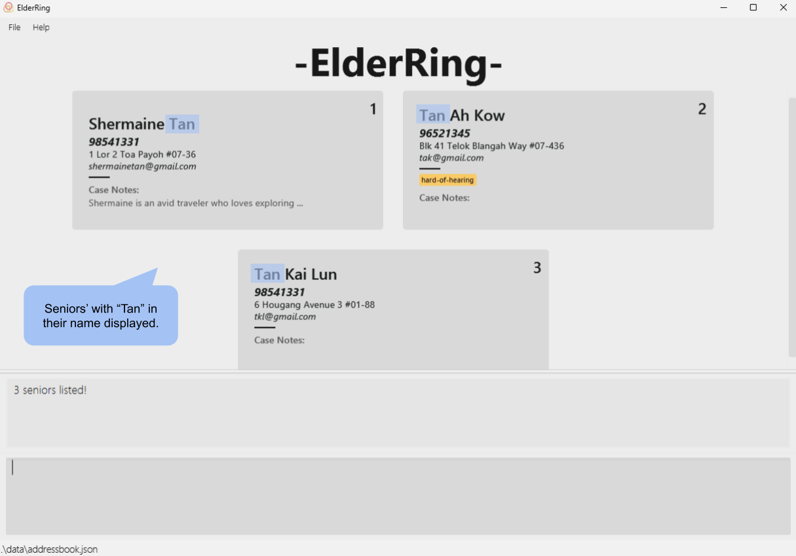
  <figcaption style="text-align: center; font-style: italic">
    <md>Results of the command: `find tan`.</md>
  </figcaption>

</figure>

 

<box style="background: #fafafaff">

**Navigate to the subsections here:**
<a href="#parameters" class="badge bg-secondary">Parameters</a> 
<a href="#command-summary" class="badge bg-secondary">Command Summary</a>
<a href="#introduction" class="badge bg-light text-dark">Back to top</a>

</box>

 

### Adding notes to a senior : `remark`

Adds relevant miscellaneous information to an existing senior. This feature can replace the current remark, append to the existing remark, or remove it.

Format: `remark i/INDEX r/REMARK` or `remark i/INDEX ap/APPEND_TEXT` or `remark i/INDEX --remove`

#### Parameters:

1. `INDEX`: Mandatory.

With exactly one of:

2. `REMARK`: Mandatory.
3. `APPEND_TEXT`: Mandatory.
4. `--remove`: Mandatory.

<box type="warning">

**Warning**: Avoid putting spaces immediately after prefixes (e.g., `i/`, `r/`, `ap/`, `--remove`) — the value must follow the prefix directly, or the command may be treated as invalid.

</box>

Examples:
* `remark i/1 r/Senior is aggressive`
* `remark i/1 ap/Followed up on 24 Oct`
* `remark i/1 --remove`

<figure>

  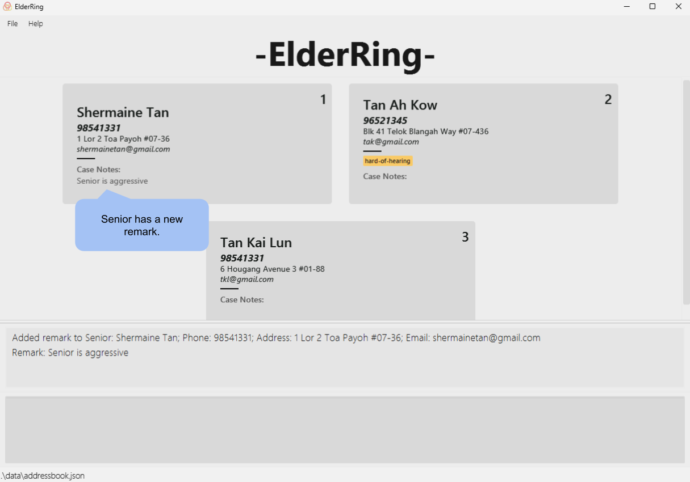
  <figcaption style="text-align: center; font-style: italic">
    <md>Results of the command: `remark i/1 r/Senior is aggressive`.</md>
  </figcaption>

</figure>

 

<box style="background: #fafafaff">

**Navigate to the subsections here:**
<a href="#parameters" class="badge bg-secondary">Parameters</a> 
<a href="#command-summary" class="badge bg-secondary">Command Summary</a>
<a href="#introduction" class="badge bg-light text-dark">Back to top</a>

</box>

 

### Tagging a senior : `tag`

Tags (or untags) the senior at the specified display `INDEX` or the senior with a matching `NAME` and `PHONE_NUMBER`. 
Tags are meant to serve as labels and hence are only stored as lowercase.

<box type="tip" seamless>

**Tip:** Tagging can be used as a categorisation feature in conjunction with the filter feature.

</box>

Format: `tag i/INDEX t/TAG [ --remove]` or `tag n/NAME p/PHONE_NUMBER t/TAG [ --remove]`.
#### Parameters:

1. `TAG`: Mandatory.
2. `--remove`: Optional.

Either:
3. `INDEX`: Mandatory.

Or:
4. `NAME`: Mandatory.
5. `PHONE`: Mandatory.

Examples:
* `tag i/1 t/hard-of-hearing`
* `tag n/John Doe p/91234567 t/hard-of-hearing`
* `tag i/1 t/hard-of-hearing --remove`

<figure>

  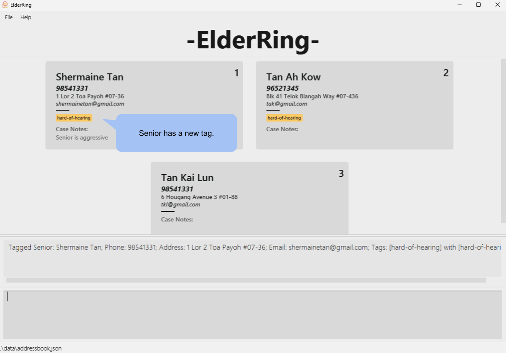
  <figcaption style="text-align: center; font-style: italic">
    <md>Results of the command: `tag i/1 t/hard-of-hearing`.</md>
  </figcaption>

</figure>

 

<box style="background: #fafafaff">

**Navigate to the subsections here:**
<a href="#parameters" class="badge bg-secondary">Parameters</a> 
<a href="#command-summary" class="badge bg-secondary">Command Summary</a>
<a href="#introduction" class="badge bg-light text-dark">Back to top</a>

</box>

 

### Filtering entries : `filter`

Only displays the entries matching the entire input tag(s) exactly. Filter does not match tags which partially match the input tag(s).

<box type="tip" seamless>

**Tip**: Filtering can be used as a more specific alternative to the list feature.

</box>

Format: `filter t/TAG [t/TAG]...`

#### Parameters:

1. `TAG`: Mandatory.

Examples:
* `filter t/hard-of-hearing`

<figure>

  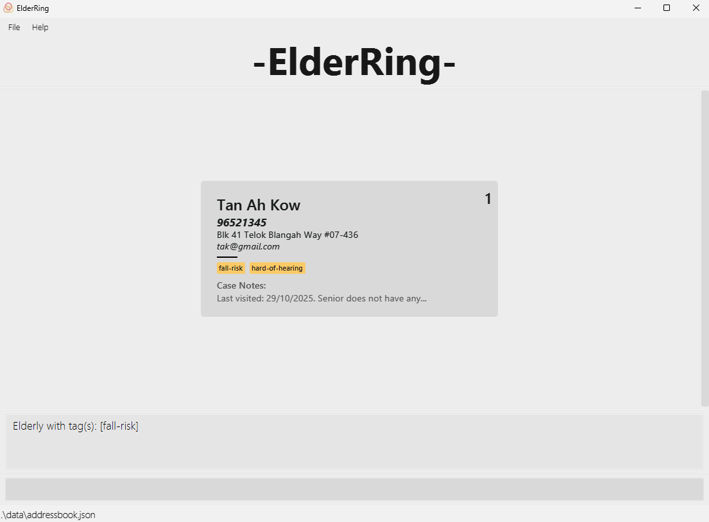
  <figcaption style="text-align: center; font-style: italic">
    <md>Results of the command: `filter t/hard-of-hearing`.</md>
  </figcaption>

</figure>

<box type="warning">

**Warning**: If the tag specified does not exist, this feature will not display any entries.
To display the original list of seniors, use the [list](#listing-all-seniors-list) command.

</box>

 

<box style="background: #fafafaff">

**Navigate to the subsections here:**
<a href="#parameters" class="badge bg-secondary">Parameters</a> 
<a href="#command-summary" class="badge bg-secondary">Command Summary</a>
<a href="#introduction" class="badge bg-light text-dark">Back to top</a>

</box>

 

### Clearing all entries : `clear`

Clears all entries from ElderRing.

Format: `clear --removeall`

#### Parameters:

1. `--removeall`: Mandatory.

<figure>

  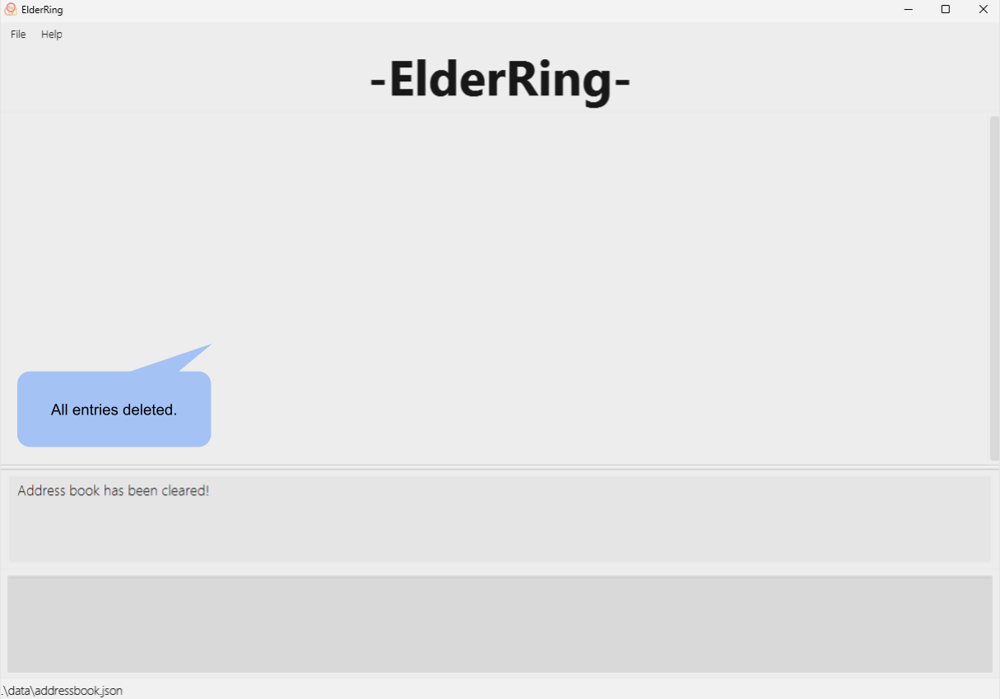
  <figcaption style="text-align: center; font-style: italic">
    <md>Results of the command: `clear --removeall`.</md>
  </figcaption>

</figure>

<box type="warning">

**Warning**: Be careful. This command irreversibly deletes ALL entries (this operation cannot be undone).

</box>

 

<box style="background: #fafafaff">

**Navigate to the subsections here:**
<a href="#parameters" class="badge bg-secondary">Parameters</a> 
<a href="#command-summary" class="badge bg-secondary">Command Summary</a>
<a href="#introduction" class="badge bg-light text-dark">Back to top</a>

</box>

 

### Exiting the program : `exit`

Exits the program.

Format: `exit`

 

<box style="background: #fafafaff">

**Navigate to the subsections here:**
<a href="#parameters" class="badge bg-secondary">Parameters</a> 
<a href="#command-summary" class="badge bg-secondary">Command Summary</a>
<a href="#introduction" class="badge bg-light text-dark">Back to top</a>

</box>

 

### Saving the data

ElderRing data is automatically saved in the hard disk after any command that modifies the data. There is no need for manual saving.

<box type="info" seamless>

The application supports up to **250 entries** to maintain optimal performance while meeting the operational needs of volunteers who typically manage a manageable number of senior contacts.

</box>

 

### Editing the data file

ElderRing data are automatically saved as a JSON file `[JAR file location]/data/addressbook.json`. Advanced users are welcome to update the data by directly editing that file.

<box type="warning">

**Warning:**
* If the data file contains invalid formatting (broken JSON, parsing errors, file permission issues, etc.), ElderRing discards all data and start with an empty data file.
* Certain edits may cause unexpected behavior. Edit the data file only if you are confident in maintaining the correct format.
* Adding any of the prefix used in this application may cause unintended behaviors.

**Data validation during loading**
* **Invalid entries**:  Entries must contain `name`, `phone`, and `address` fields. Entries missing any required field are skipped.
* **Duplicate entries**: Contacts with identical names and phone numbers are automatically removed.
* **Optional fields**: Missing optional fields (`email`, `remark`, `tags`) are auto-filled with default values (empty string for email/remark, empty array for tags).

**Tip:** Always back up the file before editing.

</box>

 

--------------------------------------------------------------------------------------------------------------------

 

## FAQ

**Q**: How do I transfer my data to another computer? 
**A**: Install the app in the other computer and overwrite the empty data file it creates with the file that contains the data of your previous ElderRing home folder.

 

<a href="#introduction">Back to top</a>

 

--------------------------------------------------------------------------------------------------------------------

 

## Known Issues

1. **When using multiple screens**, the GUI will open off-screen if you move the application to a secondary screen, and later switch to using only the primary screen.  

 

The remedy is to delete the `preferences.json` file created by the application (in the same folder as the JAR file) before running the application again.  

 

<a href="#introduction">Back to top</a>

 

--------------------------------------------------------------------------------------------------------------------

 

## Command Summary

| Command                                                            | Usage                                                                                     | Example                                                                                            |
|--------------------------------------------------------------------|-------------------------------------------------------------------------------------------|----------------------------------------------------------------------------------------------------|
| **[help](#viewing-help-help)**                                     | `help`                                                                                    | `help`                                                                                             |
| **[add](#adding-a-senior-add)**                                    | `add n/NAME p/PHONE_NUMBER a/ADDRESS [e/EMAIL] [t/TAG]…​`                                 | `add n/James Ho p/98652148 a/123, Clementi Rd, 1234665 e/jamesho@example.com t/friend t/colleague` |
| **[edit](#editing-a-senior-edit)**                                 | `edit i/INDEX [n/NAME] [p/PHONE_NUMBER] [e/EMAIL] [a/ADDRESS] [t/TAG]​…`                  | `edit i/2 n/James Lee e/jameslee@example.com`                                                      |
| **[delete (by index)](#deleting-a-senior-delete)**                 | `delete i/INDEX`                                                                          | `delete i/3`                                                                                       |
| **[delete (by name and phone number)](#deleting-a-senior-delete)** | `delete n/NAME p/PHONE_NUMBER`                                                            | `delete n/Amy p/61234567`                                                                          |
| **[list](#listing-all-seniors-list)**                              | `list`                                                                                    | `list`                                                                                             |
| **[sort (by name)](#sorting-entries-sort)**                        | `sort (ASC or DSC)/NAME`                                                                  | `sort asc/name` or `sort dsc/name`                                                                 |
| **[sort (by address)](#sorting-entries-sort)**                     | `sort (ASC or DSC)/ADDRESS`                                                               | `sort asc/address` or `sort dsc/address`                                                           |
| **[find (by name)](#locating-seniors-by-name-find)**               | `find KEYWORD [MORE_KEYWORDS]​…`                                                          | `find alex` or `find can ran`                                                                      |
| **[remark](#adding-notes-to-a-senior-remark)**                     | `remark i/INDEX r/REMARK` or `remark i/INDEX ap/APPEND_TEXT` or `remark i/INDEX --remove` | `remark i/10 ap/Person is kind`                                                                    |
| **[tag (by index)](#tagging-a-senior-tag)**                        | `tag i/INDEX t/TAG`                                                                       | `tag i/1 t/hard-of-hearing`                                                                        |
| **[tag (by name and phone number)](#tagging-a-senior-tag)**        | `tag n/NAME p/PHONE_NUMBER t/TAG`                                                         | `tag n/John Doe p/91234567 t/hard-of-hearing`                                                      |
| **[filter](#filtering-entries-filter)**                            | `filter t/TAG`                                                                            | `filter t/hard-of-hearing`                                                                         |
| **[clear](#clearing-all-entries-clear)**                           | `clear --removeall`                                                                                   | `clear --removeall`                                                                                            |
| **[exit](#exiting-the-program-exit)**                              | `exit`                                                                                    | `exit`                                                                                             |

 

<a href="#introduction">Back to top</a>
