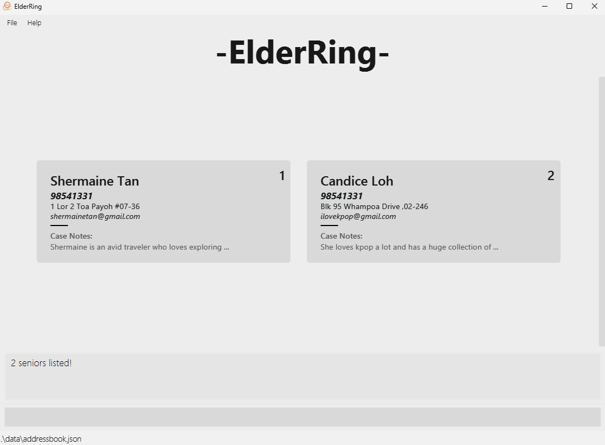
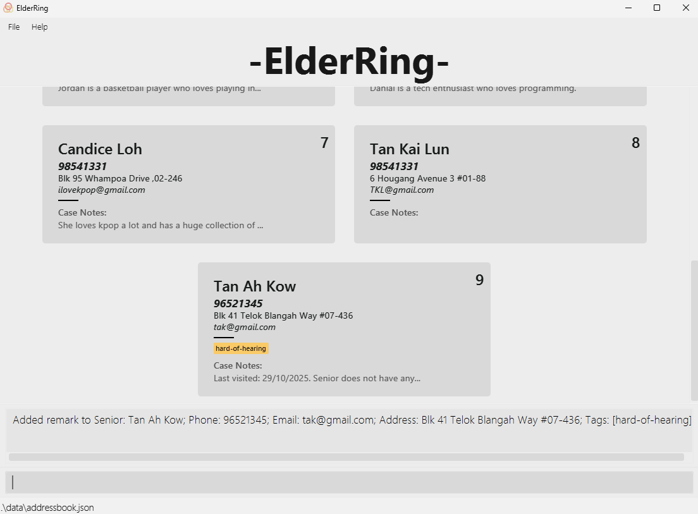
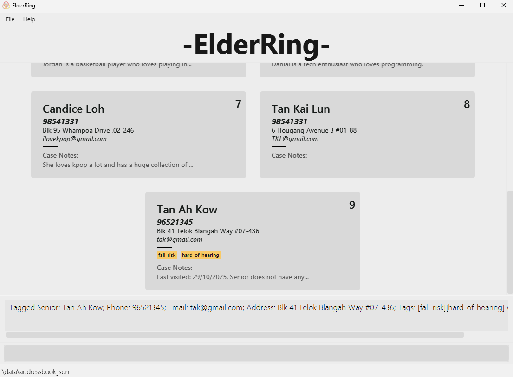

# ElderRing User Guide

## Introduction
**ElderRing** is a **desktop application** made for Silver Generation Ambassadors (SGAs) to better **manage and organise senior clients' information** more efficiently. With simple-to-type commands, seniors' contacts can be managed faster than traditional Graphical User Interface (GUI) applications.

<!-- * Table of Contents -->
<page-nav-print />

--------------------------------------------------------------------------------------------------------------------
## How to Read This Guide

This guide is designed for everyone, whether you're just starting out or are already familiar with ElderRing.

If you are **new to ElderRing**:
- Head to [Quick Start](#quick-start) to learn how to get started

If you have **experience with ElderRing**:
- Check out the [Command Summary](#command-summary) for a quick overview of the various commands and their usage.
- Check out the [Features](#features) section for a more in-depth breakdown of each feature.

#### Additional Information

Additional information is indicated as a box with an "**i**" symbol.

<box type="info" seamless>

This is an example of additional information.

</box>

#### Tips

Tips are displayed as a box with a "**💡**" symbol.

<box type="tip" seamless>

This is an example of a tip!

</box>

#### Warnings

Warnings are displayed as a box with a "**!**" symbol.

<box type="warning">

This is an example of a warning!

</box>

--------------------------------------------------------------------------------------------------------------------
## Quick Start

This guide serves as a walkthrough on **how to install ElderRing** and **how to use it**!

<box header=" **By the end of this section, you will:**">

- Have installed **ElderRing** on your computer.
- Know how to run **ElderRing**.

</box>

### Installation
1. Ensure you have Java `17` or above installed on your computer. 

<box type="info" seamless>

If you are unsure of how to install Java, follow this [guide](https://www.java.com/en/download/help/download_options.html).

**Mac users:** Ensure you have the precise JDK version prescribed [here](https://se-education.org/guides/tutorials/javaInstallationMac.html).

</box>

2. Download the latest [`ElderRing.jar`](https://github.com/AY2526S1-CS2103T-T14-4/tp/releases).

3. Copy the file to the folder you want to use as the _home folder_ for ElderRing.

4. Open a command terminal, `cd` into the folder containing `ElderRing.jar`, and use the `java -jar ElderRing.jar` command to run the application.  
   A GUI similar to the below should appear in a few seconds. Note how the app contains some sample data. 
   

5. Type the command in the command box (located at the bottom of the window) and press Enter to execute it.

<box type="tip" seamless>

Typing **`help`** and pressing Enter will open the help window.

</box>

   Some example commands you can try:

   * `list` : Lists all contacts.

   * `add n/John Doe p/98765432 e/johnd@example.com a/John street, block 123, #01-01` : Adds a contact named `John Doe` to the Address Book.

   * `delete i/3` : Deletes the 3rd contact shown in the current list.

   * `clear` : Deletes all contacts.

   * `exit` : Exits the app.

6. Refer to the [Features](#features) section below for details of each command.

--------------------------------------------------------------------------------------------------------------------

## Features

This section covers the list of commands and their usage. If you are experienced with the commands, you can refer to the [Command Summary](#command-summary) below for quicker reference.

<box type="info" seamless>

**Notes about the command format:** 

* Words in `UPPER_CASE` are the parameters to be supplied by the user. 

  <box>

  e.g., in `add n/NAME`, `NAME` is a parameter which can be used as `add n/John Doe`.

  </box>

* Parameters in `[ square brackets ]` are optional. 

  <box>

  e.g., `n/NAME [t/TAG]` can be used as `n/John Doe t/friend` or as `n/John Doe`.

  </box>

* Parameters split by the `|` symbol are alternatives.

  <box>

  e.g., `remark i/INDEX [r/REMARK | ap/APPEND_TEXT | --remove]` can be used as `remark i/1 r/Patient is diabetic.` or
  `remark i/1 ap/Prescribed diabetes medication.` or `remark i/1 --remove`

  </box>

* Parameters with `…`​ after them can be used multiple times (including zero times). 

  <box>

  e.g., `[t/TAG]…​` can be used as ` ` (i.e. 0 times), `t/friend`, `t/friend t/family` etc.

  </box>

* Parameters can be in any order. 
  
  <box>

  e.g., if the command specifies `n/NAME p/PHONE_NUMBER`, `p/PHONE_NUMBER n/NAME` is also acceptable.

  </box>

* Extraneous parameters for commands that do not take in parameters (such as `help`, `list`, `exit` and `clear`) will be ignored. 

  <box>

  e.g., if the command specifies `help 123`, it will be interpreted as `help`.

  </box>

* If you are using a PDF version of this document, be careful when copying and pasting commands that span multiple lines as space characters surrounding line-breaks may be omitted when copied over to the application.

</box>

### Parameters

This section covers the different parameters in ElderRing and their respective constraints.

| Parameter      | Description                                   | Constraints                                                                                                                                                                                    | Example                                                                                                      |
|----------------|-----------------------------------------------|------------------------------------------------------------------------------------------------------------------------------------------------------------------------------------------------|--------------------------------------------------------------------------------------------------------------|
| `NAME`         | Senior’s name                                | <ul><li>Only letters and spaces are permitted.</li><li>This parameter cannot be left blank.</li></ul>                                                                                          | :fa-solid-check:  `John Doe`                                                                           |
| `PHONE_NUMBER` | Senior’s phone number                        | <ul><li>Only numbers are allowed.</li><li>This parameter cannot be left blank.</li><li>Only accepts numbers that are 8-digits.</li><li>Only accepts numbers that start with 6, 8, 9.</li></ul> | :fa-solid-check:  `91234567`                                                                           |
| `ADDRESS`      | Senior’s residential address                 | <ul>No constraints </ul>                                                                                                                                                                       | :fa-solid-check:  `Blk 41 Telok Blangah Way #07-436`                                                   |
| `EMAIL`        | Senior’s email address                       | <ul><li>Emails should be in the format `local-part@domain`.</li><li>`local-part` must only contain letters and digits</li><li>`domain` must end in `.com`</li></ul>                           | :fa-solid-check:  `johndoe123@gmail.com`                                                               |
| `TAG`          | Category/label applicable to seniors         | <ul>No constraints </ul>                                                                                                                                                                       | :fa-solid-check:  `hard-of-hearing`                                                                    |
| `REMARK`       | Additional notes applicable to seniors       | <ul>No constraints </ul>                                                                                                                                                                       | :fa-solid-check:  `List of senior’s medications: Alprax (daily), Alprazolam (once every 3 days), ...`  |
| `INDEX`        | The index shown in the displayed seniors list | <ul><li>Only whole numbers are allowed.</li><li>Number must be a positive number.</li><li>Number must be smaller than the total number of entries.</li></ul>                                    | :fa-solid-check:  `1`                                                                                  |

 

### Viewing help : `help`

Shows a message explaining how to access the help page.

Format: `help`

 

### Adding a senior : `add`

Adds a senior to the address book.

Format: `add n/NAME p/PHONE_NUMBER a/ADDRESS [e/EMAIL] [t/TAG]…​`

#### Parameters:

1. `NAME`: Mandatory.
2. `PHONE_NUMBER`: Mandatory.
3. `ADDRESS`: Mandatory.
4. `EMAIL`: Optional.
5. `TAG`: Optional.

Examples:
* `add n/Tan Ah Kow e/tak@gmail.com p/96521345 a/Blk 41 Telok Blangah Way #07-436 t/hard-of-hearing`
* `add n/Shermaine Tan p/98541331 a/1 Lor 2 Toa Payoh #07-36 e/shermainetan@gmail.com`

 

### Editing a senior : `edit`

Edits an existing senior in the address book, only replacing the fields with new information specified in the user input.

<box type="info" seamless>

Remarks cannot be edited using this feature.

</box>

Format: `edit i/INDEX [n/NAME] [p/PHONE_NUMBER] [e/EMAIL] [a/ADDRESS] [t/TAG]`

#### Parameters:

1. `INDEX`: Mandatory.
2. `NAME`: Optional.
3. `PHONE_NUMBER`: Optional.
4. `EMAIL`: Optional.
5. `ADDRESS`: Optional.
6. `TAG`: Optional.

<box type="info" seamless>

* Edits the senior at the specified `INDEX`. The index refers to the index number shown in the displayed senior list. The index **must be a positive integer** 1, 2, 3, …​
* At least one of the optional fields must be provided.
* Existing values will be updated to the input values.
* When editing tags, the existing tags of the senior will be removed (adding of tags is not cumulative).
* You can remove all the senior’s tags by typing `t/` without specifying any tags after it.

</box>

Examples:
*  `edit i/10 t/Diabetic`
*  `edit i/1 n/Joseph p/92891234`

 

### Deleting a senior : `delete`

Deletes the senior at the specified display `INDEX` OR the senior with a matching `NAME` and `PHONE_NUMBER`.

Format: `delete i/INDEX` or `delete n/NAME p/PHONE_NUMBER`

#### Parameters:

Either:

1. `INDEX`: Mandatory.

Or:

2. `NAME`: Mandatory.
3. `PHONE_NUMBER`: Mandatory.

<box type="info" seamless>

* Deletes the senior at the specified `INDEX`.
* Deletes the senior matching the specified `NAME` and `PHONE_NUMBER`.

</box>

Examples:
* `list` followed by `delete i/2` deletes the 2nd senior in the address book.
* `delete n/Amy Tan p/61234567`.

 

### Listing all seniors : `list`

Shows a list of all seniors in the address book.

Format: `list`

<box type="tip" seamless>

If texts end with `...`, there are more information hidden. Click on the `...` to expand and view the full information (not applicable to long tags). You can also click it to hide it again.

</box>

 

### Sorting entries : `sort`

Sorts seniors by NAME or ADDRESS in ascending or descending order.

Format: `sort (ASC or DSC)/(NAME or ADDRESS)`

#### Parameters:

1. `ASC or DSC`: Mandatory.
2. `NAME or ADDRESS`: Mandatory.

<box type="info" seamless>

* `asc` sorts in ascending order
* `dsc` sorts in descending order
* `name` sorts by name
* `address` sorts by address

</box>

Examples:
* `sort asc/name`
* `sort dsc/name`
* `sort asc/address`
* `sort dsc/address`

 

### Locating seniors by name : `find`

Finds seniors whose names contain any of the given keywords.

Format: `find KEYWORD [MORE_KEYWORDS]`

* The search is case-insensitive (e.g., `hans` will match `Hans`).
* The order of the keywords does not matter (e.g., `Hans Bo` will match `Bo Hans`).
* Only the name is searched.
* Partial words within the name can be matched (e.g., `Han` will match `Hans`).
* Seniors matching at least one keyword will be returned
  (e.g., `Hans Bo` will return `Hans Gruber`, `Boyo Yang`).

Examples:
* `find alex` displays `Alex Yeoh`.
* `find can ran` displays `Candice Lim`, `Randy Tan`, `Ranger Lee`.
* `find charlotte bernice` displays `Bernice Yu`, `Charlotte Oliveiro`.

 

### Adding notes to a senior : `remark`

Adds relevant miscellaneous information to an existing senior. You can replace the remark, append to the existing remark, or remove it.

Format: `remark i/INDEX r/REMARK` or `remark i/INDEX ap/APPEND_TEXT` or `remark i/INDEX --remove`

#### Parameters:

1. `INDEX`: Mandatory.

With exactly one of:

2. `REMARK`: Mandatory.  
3. `APPEND_TEXT`: Mandatory.  
4. `--remove`: Mandatory.

Examples:
* `remark i/10 r/Senior is aggressive`
* `remark i/10 ap/Followed up on 24 Oct`
* `remark i/10 --remove`

 

### Tagging a senior : `tag`

Tags (or untags) the senior at the specified display `INDEX` OR the senior with a matching `NAME` and `PHONE_NUMBER`.

<box type="info" seamless>

Tagging can be used as a categorisation feature in conjunction with the filter feature.

</box>

Format: `tag i/INDEX t/TAG [ --remove]` or `tag n/NAME p/PHONE_NUMBER t/TAG [ --remove]` 
or `tag i/INDEX t/TAG --remove` or `tag n/NAME p/PHONE_NUMBER t/TAG --remove`

#### Parameters:

1. `TAG`: Mandatory.
2. `INDEX`: Optional.
3. `NAME`: Optional.
4. `PHONE`: Optional.

Examples:
* `tag i/1 t/hard-of-hearing`
* `tag n/John Doe p/91234567 t/hard-of-hearing`
* `tag i/1 t/hard-of-hearing --remove`

 

### Filtering entries : `filter`

Only displays the entries with the specified tag.

<box type="info" seamless>

Filtering can be used as a more specific alternative to the list feature.

</box>

Format: `filter t/TAG`

#### Parameters:

1. `TAG`: Mandatory.

Examples:
* `filter t/hard-of-hearing`

<box type="warning">

If the tag specified does not exist, there will be no entries displayed.
To display the original list of seniors, make use of the [list](#listing-all-seniors-list) command.

</box>

 

### Clearing all entries : `clear`

Clears all entries from the address book.

Format: `clear`

<box type="warning">

Be careful! This command irreversibly deletes ALL entries (This operation cannot be undone).

</box>

 

### Exiting the program : `exit`

Exits the program.

Format: `exit`

 

### Saving the data

ElderRing data is saved in the hard disk automatically after any command that changes the data. There is no need to save manually.

 

### Editing the data file

ElderRing data are saved automatically as a JSON file `[JAR file location]/data/addressbook.json`. Advanced users are welcome to update data directly by editing that data file.

<box type="warning">

**Caution:**
* If the data file contains invalid formatting (broken JSON, parsing errors, file permission issues, etc.), ElderRing will discard all data and start with an empty data file.
* Certain edits may cause unexpected behavior. Edit the data file only if you are confident in maintaining the correct format.

**Data validation during loading**
* **Invalid entries**: Entries missing required fields (name, phone, or address) are skipped
* **Duplicate entries**: Contacts with identical name and phone numbers are automatically removed
* **Optional fields**: Missing optional fields are auto-filled with default values

**Recommendation:** Always back up the file before editing.

</box>

--------------------------------------------------------------------------------------------------------------------

## FAQ

**Q**: How do I transfer my data to another computer? 
**A**: Install the app in the other computer and overwrite the empty data file it creates with the file that contains the data of your previous ElderRing home folder.

--------------------------------------------------------------------------------------------------------------------

## Known issues

1. **When using multiple screens**, the GUI will open off-screen if you move the application to a secondary screen, and later switch to using only the primary screen.   
The remedy is to delete the `preferences.json` file created by the application before running the application again.

2. **If you minimize the Help Window** and then run the `help` command (or use the `Help` menu, or the keyboard shortcut `F1`) again, the original Help Window will remain minimized, and no new Help Window will appear.   
The remedy is to manually restore the minimized Help Window.

--------------------------------------------------------------------------------------------------------------------

## Command summary

| Command                                                  | Usage                                                                    | Example                                                                                      |
|----------------------------------------------------------|--------------------------------------------------------------------------|----------------------------------------------------------------------------------------------|
| **[add](#adding-a-senior-add)**                          | `add n/NAME p/PHONE_NUMBER a/ADDRESS [e/EMAIL] [t/TAG]…​`                | `add n/James Ho p/22224444 a/123, Clementi Rd, 1234665 e/jamesho@example.com t/friend t/colleague` |
| **[edit](#editing-a-senior-edit)**                       | `edit i/INDEX [n/NAME] [p/PHONE_NUMBER] [a/ADDRESS] [e/EMAIL] [t/TAG]​…` | `edit i/2 n/James Lee e/jameslee@example.com`                                                |
| **[find (by name)](#locating-seniors-by-name-find)**     | `find KEYWORD [MORE_KEYWORDS]​…`                                         | `find alex` or `find can ran`                                                      |
| **[delete (by index)](#deleting-a-senior-delete)**       | `delete i/INDEX`                                                         | `delete i/3`                                                                                 |
| **[delete (by name and phone number)](#deleting-a-senior-delete)** | `delete n/NAME p/PHONE_NUMBER`                                           | `delete n/Amy p/61234567`                                                                    |
| **[tag (by index)](#tagging-a-senior-tag)**              | `tag i/INDEX t/TAG`                                                      | `tag i/1 t/hard-of-hearing`                                                                  |
| **[tag (by name and phone number)](#tagging-a-senior-tag)** | `tag n/NAME p/PHONE_NUMBER t/TAG`                                        | `tag n/John Doe p/91234567 t/hard-of-hearing`                                                |
| **[remark](#adding-notes-to-a-senior-remark)**           | `remark i/INDEX r/REMARK` or `remark i/INDEX ap/APPEND_TEXT` or `remark i/INDEX --remove` | `remark i/10 ap/Person is kind`                                                               |
| **[sort (by name)](#sorting-entries-sort)**              | `sort (ASC or DSC)/NAME`                                                 | `sort asc/name` or `sort dsc/name`                                                           |
| **[sort (by address)](#sorting-entries-sort)**           | `sort (ASC or DSC)/ADDRESS`                                             | `sort asc/address` or `sort dsc/address`                                                     |
| **[list](#listing-all-seniors-list)**                    | `list`                                                                   | `list`                                                                                       |
| **[help](#viewing-help-help)**                           | `help`                                                                   | `help`                                                                                       |
